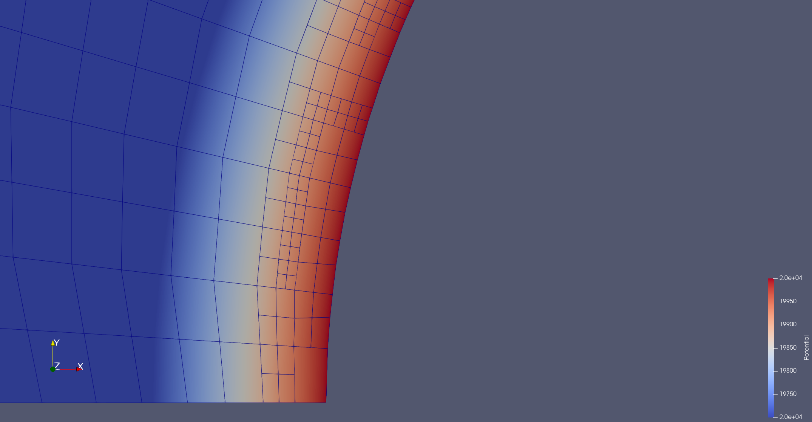
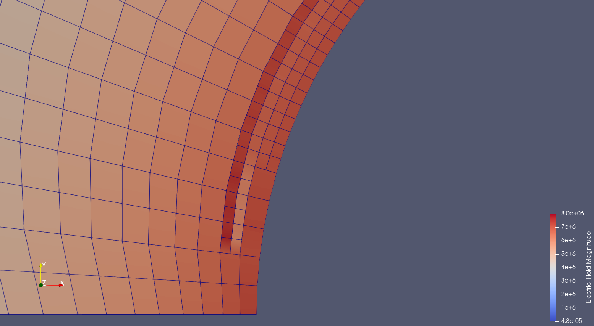
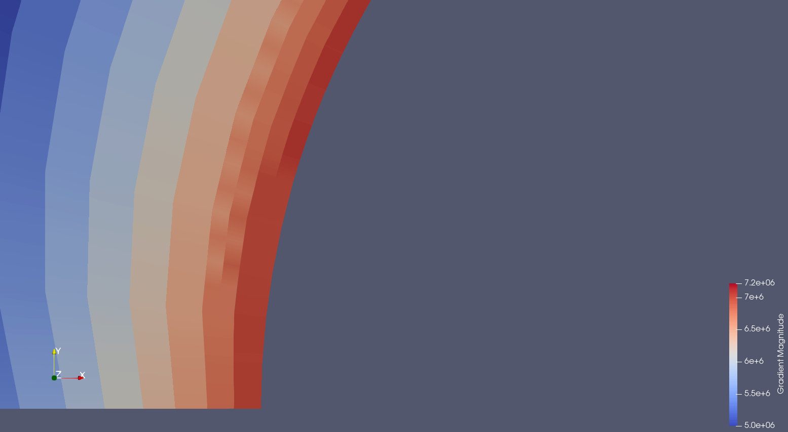
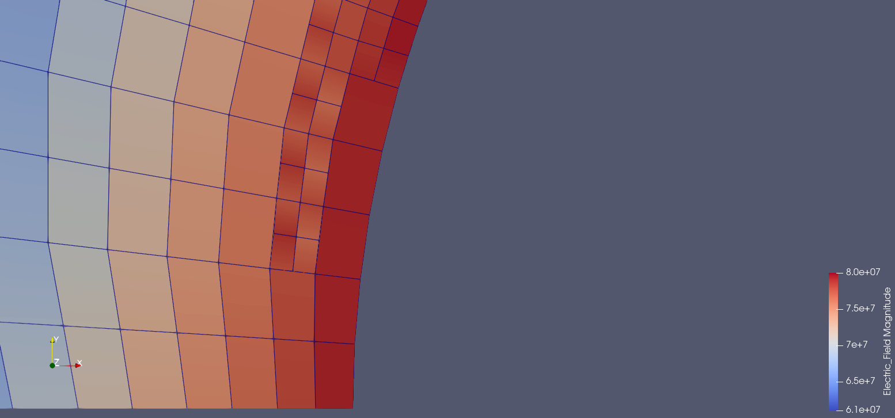

# Solving the Gradient issue
### Notes on experiments and deductions

#### Description of the problem:
<p align="left">
  

  This is the voltage around the emitter after one refinement. Colours are rescaled in range 19.700-20.000V. All fine.

  

  Unfortunately, the electric field presents inconsistencies.
</p>

## Immediate observations
💡 The problem arises only on cells with hanging nodes. So, hanging nodes play a role.

💡 The error occurs in the FEM solution itself, nothing to do with the dual problem or the goal-oriented refinement of the mesh.

💡 Zooming in, you can notice artefacts on the edges of split cells. I dont't know yet if it is a problem of the preview or a real inconsistency. Anyways, this shouldn't be contributing to the problem at hand.

## Experiments and deductions
Legend:
- ✅ : experiment complete
- 💢 : contraddictory results

### Experiment [1] ✅

🔍 Compute the Electric Field via the Gradient filter of Paraview on the voltage solution. Same result.

💡 The problem doesn't lie in the function of the code that extrapolates the discrete gradient from the solution of the FEM, which is just the voltage.

### Experiment [2] ✅

🔍 Tried to reinitialize and set up hanging nodes constraints after the first refinemnt.
Specifically I:
- reinit primal_constraints  
- reinit primal_dof_handler

No changes.

💡 Hanging nodes' constraints are applied, problem is not that they are missing.
(A more in-depth study will be necessary to really understand in which phase they should be imposed, but the reflection still holds.)

### Experiment [3] 💢

🔍 Radial plot-over-line of Gradient (obtained through Paraview) and Electric Field. (reviewing) They seem to show that there are some jumps in values, small but sudden, thus explaining the weird gradient magnitudes' distribution.

🔍 Close-up look at Voltage, as per in first image of this file. Colours are rescaled in range 19.700-20.000V. There seems not to be strange gradients to justify the peaks in the ElectricField

💡 Still to determine if problem also lies in the Voltage, implying in the solution of the system, or just in the ElectricField.

### Experiment [4] 💢

#### 4.a
🔍 Removed manual lifting by:
- deleting code for adding :  $uh = u0 +Rg$
- deleting code in assembly of the primal system to compute the bilinear form : $a_{loc}(Rg, vh)$
- Set Dirichlet BC from 0V, 0V to 20.000V, 0V at the emitter and collector respectively.

<p align="left">
  

</p>

💡 Problem perstist on a smaller scale, indicating that Rg function and maual lifting <span style="color: red">might not be</span> responsible.


#### 4.b
🔍 Saved only Rg, deleting the solution of the system by replacing code for:
- $uh = u0 +Rg$   \
with
- $uh = Rg$ 
<p align="left">
  

</p>

💡 Problem perstist on a smaller scale, indicating that Rg function and maual lifting <span style="color: red">could be</span> responsible.

## Attempted solutions on Rg
Legend:
- ✅ : success
- ⏺️ : partial success
- ❌ : fail


### Attempt [1] ❌
🔍 Project rater than interpolate. 

Specifically, at line 961:
```cpp
VectorTools::project(primal_dof,
                    primal_constraints,
                    dual_quadrature, // Just bcs it's of higher order
                    Evaluate_Rg<dim>(),
                    Rg_vector)
```
💡 Problem on gradient of Rg persists. Also if ElectricField is obtained by Gradient filter on the Potential.

### Attempt [2] ❌
🔍 Reinitialize hanging nodes in the phase where the lifting is summed back $u_h=u_0+R_g$. Steps:
```cpp
primal_constraints.clear()
AffineConstraints::make_hanging_node_constraints(...)
primal_constraints.close()
VectorTools::project(..., Rg_vector, ...)
primal_constaints.distribute(Rg_vector)
// ... u_h = u_0 + R_g
```
💡 No difference observed.


## Other reflections

- Il problema dovrebbe risolversi alla radice se si utilizzassero come FE dei dei “polinomi a tratti, globalmente C1” invece ch dei “polinomi a tratti, globalmente C0”. Conoscete qualche FE globalmente C1 che posso ricercare?
- Qualsiasi altro sugerimento è molto ben accetto.
